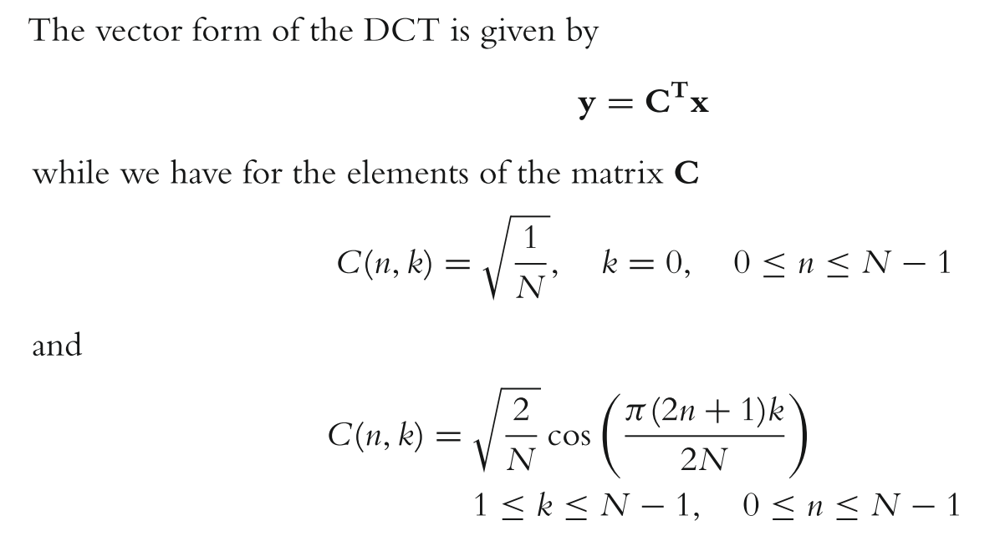

# Understanding how spectral response of a NMM is generated in SPM

`m` represents the number of sources.
`p` is the number of cell populations in each source. Given that we are considering the implementation with the canonical microcircuit: `p=4`.
`u` is the number of inputs.
`c` is the number of sensor channels.

## Function dissection: [spm_csd_mtf.m](https://tnurepository.ethz.ch/inesb/anti-nmda/blob/master/src/preproc_and_DCM/src/spm12/toolbox/dcm_meeg/spm_csd_mtf.m)

From the function documentation: *When called with U this function will return a cross-spectral response for each of the condition-specific parameters specified in U.X; otherwise it returns the complex CSD for the parameters in P (using the expansion point supplied in M.x).*

M.x contains the hidden states! In our case, the membrane voltage and the conductances for all three receptors AMPA, NMDA and GABA.

### Function outline:
- Check for experimental inputs (none in our model);
- Define frequencies of interest;
- Check number of channels (7 in our case)
    - COMMENT: this part is also supposed to, according to the documenation, get exogenous (neuronal) inputs or sources. Instead, stores the number of different frequencies which are being analyzed (see [here](https://tnurepository.ethz.ch/inesb/anti-nmda/blob/master/src/preproc_and_DCM/src/spm12/toolbox/dcm_meeg/spm_csd_mtf.m#L72)).
- Obtain spectrum of innovations (Gu) and noise (Gs and Gn)
    - Calls [spm_csd_mtf_gu.m](https://tnurepository.ethz.ch/inesb/anti-nmda/blob/master/src/preproc_and_DCM/src/spm12/toolbox/dcm_meeg/spm_csd_mtf_gu.m)

## Function dissection: [spm_csd_mtf_gu.m](https://tnurepository.ethz.ch/inesb/anti-nmda/blob/master/src/preproc_and_DCM/src/spm12/toolbox/dcm_meeg/spm_csd_mtf_gu.m)

From the function documentation (c here in not the `c` defined above! Figure this out!)
- pE.a(2,m) - neuronal fluctuations        - amplitude and exponent
- pE.b(2,c) - channel noise (non-specific) - amplitude and exponent
- pE.c(2,c) - channel noise (specific)     - amplitude and exponent
- pE.d(8,m) - neuronal fluctuations        - basis set coefficients

### Function outline:
- Gets number of sources and frequencies analyzed.
- Generates spectrum of neuronal innovations `Gu`
    - **Loops** over sources and computes, for the i-th source: `Gu(:,i) = exp(P.a(1,i))*f.^(-exp(P.a(2,i)))`
        - Comments:
            - Positivity constraint imposed on amplitude → scalar!
            - Negativity constraint imposed on exponent → scalar!
            - Hence, output is: `A*(1/f^B)`, `f` is a vector containing the analyzed frequencies.
    - **Output**: `Gu` is `5 by 4` → neuronal innovations per analyzed frequency, per source.
- Computes discrete cosine set (DCT) of order 8 (in our SPM version) and 4 (in [SPM12](https://github.com/spm/spm12/blob/master/toolbox/dcm_meeg/spm_ssr_priors.m#L53))
    - **Reminder**: `y` is the data, `C` is represented by `X` in the code, and `x` is our `d`!
<!---->

- **DON'T UNDERSTAND:** `Mu = exp(X(:,2:end)*P.d)`

